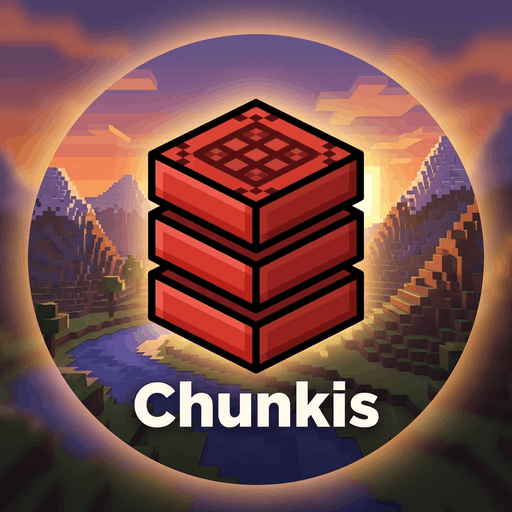

# Chunkis

**Chunkis** is a high-performance, sparse chunk storage mod for Minecraft. It replaces or augments the traditional Anvil (`.mca`) format with a custom binary format called **CIS (Chunk Information Storage)**, designed for extreme space efficiency and rapid delta-updates.

## 🚀 The Philosophy: Sparse & Lean
Traditional Minecraft storage saves every single block in a chunk, including thousands of "Air" blocks. **Chunkis** takes the opposite approach: **If it hasn't changed, don't save it.** 

By only persisting "Deltas" (changes relative to the world generator), Chunkis files are often **90-95% smaller** than vanilla files while maintaining bit-perfect accuracy for player-placed blocks, inventories, and states.

> [!IMPORTANT]
> **Beta Stage**: Supports Single Player and Servers.
> Always backup your world before installing!

---

## ✨ Key Features

- **CIS Binary Format (V7)**: Custom bit-packed protocol with ZigZag delta encoding.
- **Sparse Storage**: V7 format enforces sparse encoding to eliminate "air bloat" completely.
- **Context-Aware Packing**: Automatically compresses block states (Facing, Open/Closed, Powered, etc.) into single bytes.
- **Robust Entity Persistence**: accurately captures and restores NBT data for Chests, Furnaces, and Entities.
- **Deadlock-Free I/O**: Multi-threaded storage engine with granular locking prevents server stalls during auto-saves.
- **Clean Console**: Optimized logging ensures the server console remains spam-free during operation.

---

## 🏗️ How it Works

### 1. Interception (Mixins)
Chunkis hooks into the Minecraft saving pipeline (`ThreadedAnvilChunkStorage`) and chunk construction (`WorldChunk`):
- When a block is placed, a `ChunkDelta` records the change.
- When a chunk saves, Chunkis serializes this Delta to a `.cis` file.
- When a chunk loads, Chunkis reconstructs the player's changes on top of the base world.

### 2. The CIS7 Data Format
A `.cis` file is structured into four main layers:

| Layer | Description |
| :--- | :--- |
| **Header** | Magic `CIS` signature and versioning (V7). |
| **Global Palette** | A list of unique `BlockStates` used in the chunk. |
| **Instruction Stream** | A bit-packed sequence of instructions. Uses "jumps" to skip unchanged blocks. |
| **Entity Data** | Accurate NBT snapshots of block entities (Chests) and global entities (Mobs/Items). |

### 3. State Packing Logic
To save bits, Chunkis "packs" Minecraft properties into a single byte:
- **Bits 0-2**: Directional Facing (North, South, etc.)
- **Bit 3**: Double-block half / Bed part.
- **Bit 4**: Open/Closed state / Hinges.
- **Bit 5**: Powered/Occupied status.
- **Bits 6-7**: Chest Type / instrument / specialized data.

---

## 📁 Data Layout Overview
```text
Root/
└── chunkis/
    ├── global_ids.json    (Mapping registry for portability)
    └── regions/
        ├── r.0.0.cis      (Sparse region containing 32x32 chunks)
        ├── r.0.1.cis
        └── ...
```

---

## 🛠️ Development & Building
Chunkis is built using the **Fabric** modding toolchain.

1. Clone the repository.
2. Run `./gradlew build`.
3. The mod jar will be in `build/libs/`.
